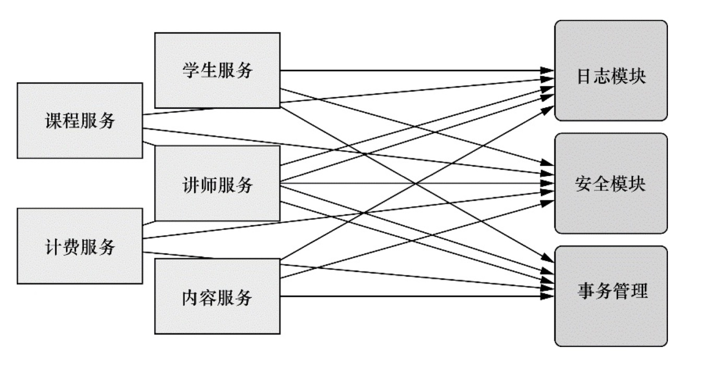
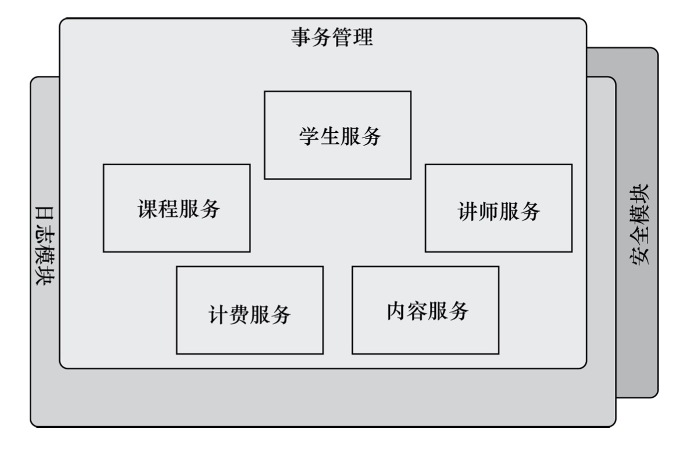
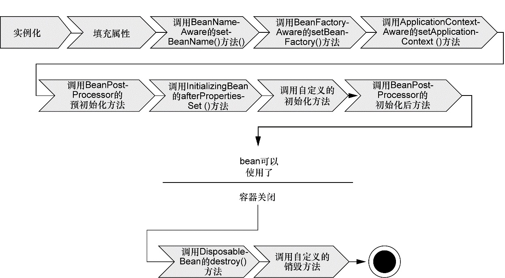

# 第一章笔记

## 概述

* Spring框架是以简化Java EE应用程序的开发为目标而创建的。
* 为了降低Java开发的复杂性，Spring采取了以下4种关键策略:
  * 基于POJO的轻量级和最小侵入性编程；
  * 通过依赖注入和面向接口实现松耦合；
  * 基于切面和惯例进行声明式编程；
  * 通过切面和模板减少样板式代码。

## 依赖注入

* 耦合具有两面性(two-headed beast)，耦合是必须的，但应当被小心谨慎地管理：
  * 一方面，紧密耦合的代码难以测试、难以复用、难以理解，并且典型地表现出“打地鼠”式的bug特性(修复一个bug，将会出现一个或者更多新的bug)。
  * 另一方面，一定程度的耦合又是必须的——完全没有耦合的代码什么也做不了。为了完成有实际意义的功能，不同的类必须以适当的方式进行交互。
* DI 所带来的最大收益——松耦合。如果一个对象只通过接口(而不是具体实现或初始化过程)来表明依赖关系，那么这种依赖就能够在对象本身毫不知情的情况下，用不同的具体实现进行替换（例如：[BraveKnight 关联 Quest](https://github.com/hiwangzi/learn-spring-in-action-v4/blob/fd4ea6d1eef81a3922626c2566e28dd5e7623b06/chapter1/src/main/java/com/hiwangzi/chapter1/knight/impl/BraveKnight.java#L10)，这里BraveKnight关联的是接口，而不是具体的实现）。
* 创建应用组件之间协作的行为通常称为装配（wiring）
  * [基于 XML 的配置](https://github.com/hiwangzi/learn-spring-in-action-v4/blob/fd4ea6d1eef81a3922626c2566e28dd5e7623b06/chapter1/src/main/resources/knights.xml)
  * [基于 Java 的配置](https://github.com/hiwangzi/learn-spring-in-action-v4/blob/fd4ea6d1eef81a3922626c2566e28dd5e7623b06/chapter1/src/main/java/com/hiwangzi/chapter1/KnightConfig.java)
* Spring 通过应用上下文（Application Context）装载 bean 的定义并把他们组装起来。Spring应用上下文全权负责对象的创建与组装。Spring自带了应用上下文的实现，它们之间的主要区别仅仅在于如何加载配置。

## 应用切面

* DI 关注松耦合，AOP 关注将遍布应用各处的功能分离形成可**重用**的组件
  * 面向切面编程往往被定义为促使软件系统实现关注点的分离一项技术。系统由许多不同的组件组成，每一个组件各负责一块特定功能。除了实现自身核心的功能之外，这些组件还经常承担着额外的职责。诸如日志、事务管理和安全这样的系统服务经常融入到自身具有核心业务逻辑的组件中去，这些系统服务通常被称为横切关注点，因为它们会跨越系统的多个组件。
  * 如果将这些关注点分散到多个组件中去，代码将会带来双重的复杂性。
    * 实现系统关注点功能的代码将会重复出现在多个组件中。这意味着如果你要改变这些关注点的逻辑，必须修改各个模块中的相关实现。即使你把这些关注点抽象为一个独立的模块，其他模块只是调用它的方法，但方法的调用还是会重复出现在各个模块中。
    * 组件会因为那些与自身核心业务无关的代码而变得混乱。一个向地址簿增加地址条目的方法应该只关注如何添加地址，而不应该关注它是不是安全的或者是否需要支持事务。
  * 下图展示了这种复杂性。左边的业务对象与系统级服务结合得过于紧密。每个对象不但要知道它需要记日志、进行安全控制和参与事务，还要亲自执行这些服务。在整个系统内，关注点(例如日志和安全)的调用经常散布到各个模块中，而这些关注点并不是模块的核心业务。
    
  * 而使用了 AOP 后，可以把切面想象为覆盖在很多组件之上的一个外壳。应用是由那些实现各自业务功能的模块组成的。借助AOP，可以使用各种功能层去包裹核心业务层。这些层以声明的方式灵活地应用到系统中，核心应用甚至根本不知道它们的存在。这是一个非常强大的理念，可以将安全、事务和日志关注点与核心业务逻辑相分离。
    
  * [吟游诗人的例子（基于 XML 的配置）](https://github.com/hiwangzi/learn-spring-in-action-v4/blob/fd4ea6d1eef81a3922626c2566e28dd5e7623b06/chapter1/src/main/resources/knights.xml#L25)
    * 如果不使用 AOP，可以将 `Minstrel`（吟游诗人） 注入 `BraveNight`，但这样会造成 `BraveNight` 代码的复杂化，例如是否还需要考虑增加判断，以应对注入的 `Minstrel` 为 `null` 的情况。

## 使用模版消除样板式代码（boilerplate code）

例如使用Spring的`JdbcTemplate`可以省去对连接的获取及对获取到数据作处理的代码。

## Spring容器

* Spring容器负责创建对象，装配它们，配置它们并管理它们的整个生命周期，从生存到死亡。
* 容器是Spring的核心。Spring容器使用DI管理构成应用的组建，它负责相互协作的组件间的关联。
* Spring容器并不是只有一个。Spring自带了多个容器实现，可以归为两种不同类型：
  * bean工厂（由`org.springframework.beans.factory.BeanFactory`接口定义）是最简单的容器，提供基本的DI支持。
  * 应用上下文（由`org.springframework.context.ApplicationContext`接口定义）基于`BeanFactory`构建，并提供应用框架级别的服务，例如从属性文件解析文本信息以及发布应用事件给感兴趣的事件监听者。
* Spring自带了多种类型的应用上下文，以下是常见的：
  * `AnnotationConfigApplicationContext`：从一个或多个基于Java的配置类中加载Spring应用上下文。
  * `AnnotationConfigWebApplicationContext`：从一个或多个基于Java的配置类中加载Spring Web应用上下文。 
  * `ClassPathXmlApplicationContext`：从类路径下的一个或多个XML配置文件中加载上下文定义，把应用上下文的定义文件作为类资源。 
  * `FileSystemXmlApplicationContext`：从文件系统下的一个或多个XML配置文件中加载上下文定义。 
  * `XmlWebApplicationContext`：从Web应用下的一个或多个XML配置文件中加载上下文定义。

### bean的生命周期

* 传统Java应用中，bean的生命周期很简单，使用`new`关键字进行实例化，然后就可以使用了，当不再使用时，由Java自动进行垃圾回收。
* Spring容器中bean生命周期就相对复杂。对于应用开发者来说，可以利用Spring提供的扩展点来自定义bean的创建过程。

1. Spring对bean进行实例化；
2. Spring将值和bean的引用注入到bean对应的属性中；
3. 如果bean实现了`BeanNameAware`接口，Spring将bean的ID传递给`setBeanName()`方法；
4. 如果bean实现了`BeanFactoryAware`接口，Spring将调用`setBeanFactory()`方法，将`BeanFactory`容器实例传入；
5. 如果bean实现了`ApplicationContextAware`接口，Spring将调用`setApplicationContext()`方法，将bean所在的应用上下文的引用传入进来；
6. 1️⃣如果bean实现了`BeanPostProcessor`接口，Spring将调用它们的`postProcessBeforeInitialization()`方法；
7. 2️⃣执行带有`@PostConstruct`注解的方法；（JSR-250规范）
8. 3️⃣如果bean实现了`InitializingBean`接口，Spring将调用它们的`afterPropertiesSet()`方法。
9. 4️⃣如果bean使用[init-method](./docs/init-method.md)声明了初始化方法，该方法也会被调用；
10. 5️⃣如果bean实现了`BeanPostProcessor`接口，Spring将调用它们的`postProcessAfterInitialization()`方法；
11. 此时，bean已经准备就绪，可以被应用使用了，它们将一直驻留在应用上下文中，直到该应用上下文被销毁；
12. 2️⃣执行带有@PreDestroy注解的方法；（JSR-250规范）
13. 3️⃣如果bean实现了`DisposableBean`接口，Spring将调用它的`destroy()`接口方法。
14. 4️⃣如果bean使用destroy-method声明了销毁方法，该方法也会被调用。

实际测试代码时遇到的一些问题：
* 6、10没有执行
* 7、12没有执行
